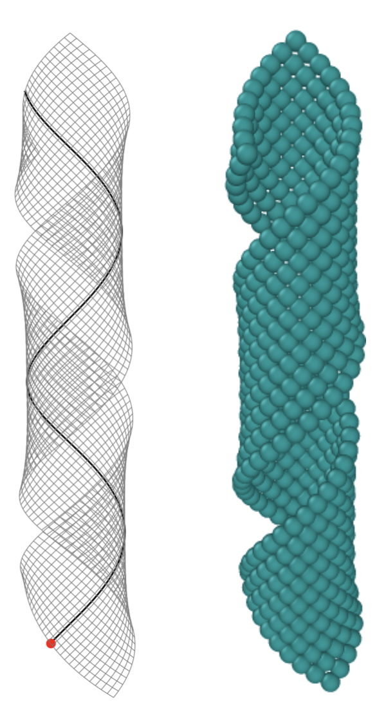
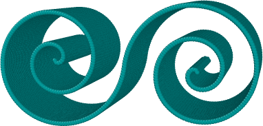

# ribbon

## Purpose

Ligand-coated semiconductor nanoplatelets (NPLs), also called nanoribbons, can
adopt a wide variety of shapes in solution or when deposited from a solution
onto a substrate. Following [Guillemeney _et al_ (2022)](http://doi.org
/10.1038/s42004-021-00621-z), the most common shapes for CdSe-type NPLs are
cylinders, helices, and helicoids. More exotic shapes have been observed with
other crystalline materials, e.g. double spiral-like shapes have been
reported by [Guillemeney _et al_ (2024)](http://doi.org/10.1021/jacs.4c04905)
for InS. While these shapes can be generated from molecular dynamics (MD)
simulations, as has been done by [Monego _et al_ (2024)](http://doi.org/
10.1073/pnas.2316299121), it is computationally very expensive for
experimentally relevant NPL sizes. In addition, MD-generated shapes invariably
contain fluctuations. While modeling shape-dependent NPL properties, e.g.
scattering patterns, it is often very useful to rapidly generate a desired
shape with certain geometric properties, e.g. pitch and radius in case of
helical ribbons. _This package_ allows us to directly generate, without any
simulation, a wide variety of idealized NPL shapes. The shapes are in the form
of a mesh and/or constituent atoms of the NPL.

## Features

* Shapes with _constant_ curvatures
  * _Cylinders_
  * _Helicoids_ (right and left handed)
  * Ribbons with a _helical centerline_ (right and left handed)
  * Degenerate helices

* Shapes with _non-constant_ centerline curvatures. The curvature and twist
  along the centerline can be specified as a function of the distance along the
centerline. In addition to new shapes, this feature allows creation of lightly
perturbed shapes around a base shape with constant curvature, which may be
useful for studying experimentally observed shape-polydispersity.

* _Spiral_ shaped ribbons can be created and joined end-to-end to form _double
  spirals_. Many different spirals are supported:
  * _Generalized Archimedean_ spirals (includes _Archimedes_ spiral,
      _Fermat_ spiral, _hyperbolic_ spiral, and _lituus_),
  * _Circle involute_
  * _Polynomial_ spirals (includes _Nielsen_ and _Cornu_). The
curvature of _Nielsen_ spirals vary exponentially (increasing or decreasing)
with arclength, which could of interest in studying the physics of certain NPL models.

## Publications

Parts of this code has been used in the following publication(s):

* L. Guillemeney, S. Dutta, R. Valleix, G. Patriarche, B. Mahler, and B. Abécassis,
  [Ligand tail controls the conformation of indium sulfide ultrathin
 nanoribbons](http://doi.org/10.1021/jacs.4c04905) _Journal of the American
 Chemical Society_ 146, 22318 (2024).

## Reference

This package is based on the formalism presented in the following papers.

1. D. Grossman, E. Sharon, and H. Diamant, [Elasticity and fluctuations of
  frustrated nanoribbons](http://doi.org/10.1103/PhysRevLett.116.258105)
 _Physical Review Letters_ 116, 258105 (2016).
2. D. Grossman, E. Sharon, and E. Katzav, [Shape and fluctuations of positively
 curved ribbons](http://doi.org/10.1103/PhysRevE.98.022502)
 _Physical Review E_ 98, 022502 (2018).
3. M. Zhang, D. Grossman, D. Danino, and E. Sharon, [Shape and fluctuations of 
frustrated self-assembled nano ribbons](http://doi.org/10.1038/s41467-019-11473-6)
_Nature Communications_ 10, 3565 (2019).

## Installation

_Dependencies_. [numpy](https://numpy.org/), [scipy](https://scipy.org/), 
[rotlib](https://github.com/saridut/rotlib). It is not necessary to separately
install them, _pip_ will install whatever is required (taking care of the
appropriate versions).

In a new virtual environment, install using the command

```bash
pip install "ribbon @ git+https://github.com/saridut/ribbon.git"
```

## Documentation

Documentation is available on [GitHub pages](https://saridut.github.io/ribbon)
of this repo.

## Examples

### A ribbon with a helical centerline

```python
import numpy as np
from ribbon import Ribbon, write_xyz
import matplotlib.pyplot as plt

length = 20.0 # Length of the ribbon
width = 4.0 # Width of the ribbon
thickness = 0.0 # Set ribbon thickness to zero for a single atomic layer

# Curvature along length
l = 0.4 
# Twist. Positive to right handed, negative for left.
m = 0.4
# Curvature along width
n = 0.4

#Set some atoms in the reference configuration. For more realistic cases
#this could be chosen from an appropriate lattice.
atom_coords = []
for x in np.arange(0, length, 0.4):
    for y in np.arange(-width/2, width/2, 0.4):
            atom_coords.append([x,y,0])
atom_coords = np.asarray(atom_coords)

#Mesh size along length
dl = 0.1
#Mesh size along width
dw = 0.1
#Mesh size along thickness
dt = 0.0 # No thickness

#Create the ribbon.
ribbon = Ribbon(length, width, thickness, dl, dw, dt)
ribbon.set_atom_refpos(atom_coords)
ribbon.set_curvatures(l, m, n)
ribbon.create(orient_along=[0,0,1]) #Orient helix axis along z.

#The (n,3) ndarray ribbon.atom_pos contains the atom positions of
#the helical ribbon.
#Write out atom positions for visualization in Ovito/VMD/etc.
write_xyz(ribbon.atom_pos[:,0], ribbon.atom_pos[:,1], ribbon.atom_pos[:,2],
    atom_symbol='C', filename='out.xyz', title='')

#Geometrical properties: Radius, pitch, etc. Below, theta is the angle between
#the principal curvature direction and the length direction of the ribbon.
print(f"radius = {ribbon.get_radius()}\n"
      f"pitch = {ribbon.get_pitch()}\n"
      f"gauss curvature = {ribbon.get_gauss_curvature()}\n"
      f"mean curvature = {ribbon.get_mean_curvature()}\n"
      f"theta = {ribbon.get_theta()}")

#Plotting the midline and the midsurface as a wireframe

figh, axh = plt.subplots(nrows=1, ncols=1, figsize=(12,9),
                subplot_kw={'projection':'3d', 'proj_type': 'persp'}
                )
axh.plot(ribbon.mline[:,0], ribbon.mline[:,1], ribbon.mline[:,2], '-k', lw=1.2)
axh.plot(ribbon.mline[0,0], ribbon.mline[0,1], ribbon.mline[0,2], 'or')
axh.plot_wireframe(ribbon.msurf[:,:,0], ribbon.msurf[:,:,1],
            ribbon.msurf[:,:,2], linestyles='-', linewidths=0.5,
            rstride=2, cstride=8, color='0.5')
axh.set_aspect('equal', 'box')
axh.set_axis_off()
plt.show()

```

Executing the above code gives

```bash
radius = 1.2499999999999998
pitch = 7.853981633974481
gauss curvature = 0.0
mean curvature = 0.4
theta = 0.7853981633974483
```

The wireframe and the atom positions visualized using 
[Ovito](https://www.ovito.org/) are shown below. On the wireframe, the dark
line marks the centerline and the red dot indicates the origin.

<center>  </center>

### A double Archimedean spiral

```python

import numpy as np
from ribbon import SpiralArchimedes, double_spiral, extrude, write_xyz

#First create a single Archimedean spiral with parameters b = 0.2 and
#r0 = 0.
length = 20.0 # Length of the spiral
width = 5.0 # Width of the ribbon
b = 0.2 # Spiral parameter
r0 = 0.0 # Spiral parameter
ds = 0.1 # Spiral arclength spacing
#Discretized arclength
s = np.linspace(0, L, 1+int(L/ds)) 
spl = SpiralArchimedes(b, r0) #Single spiral

#Create double spiral by joining end-to-end. This will make the length
#of the resulting object 2*length.
dspl = double_spiral(spl, L, ds=ds, same=False, end=1, f=0.0)

#Double spiral coordinates. dspl[0] is arclength, dspl[1] is curvature.
dspl_x = dspl[2] #x coordinates
dspl_y = dspl[3] #y coordinates

#Extrude. Atoms will be placed at x and y and extruded along z.
dz = 0.1 #Atom spacing along z
X, Y, Z = extrude(dspl_x, dspl_y, width, dz)

#Write atom positions
write_xyz(X, Y, Z, atom_symbol='C', filename='dspl.xyz', title='')
```

Below is the double spiral ribbon visualized in Ovito.

<center>  </center>
