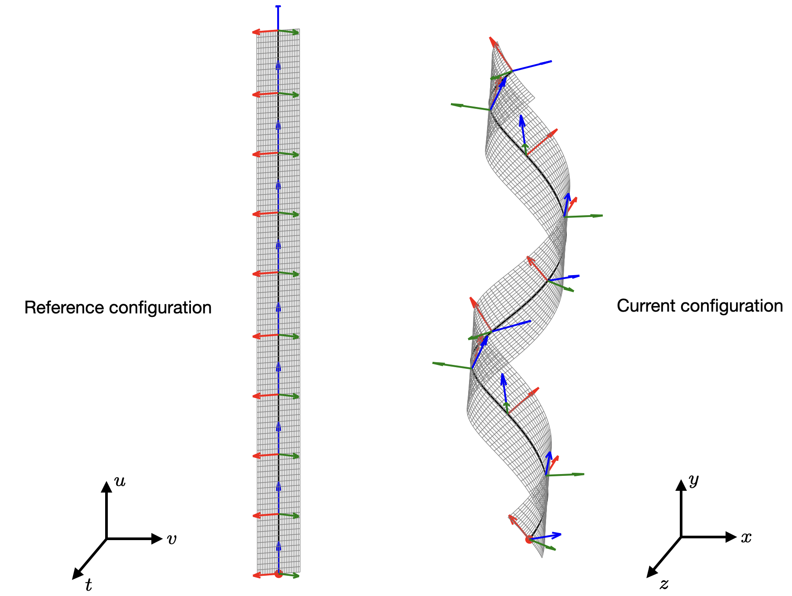

# Ribbon equations

## Generating NPL configurations

We are interested in generating NPL configurations for specified values of
curvatures. We will not consider the ligands explicitly, though the method can
generate ligand-coated NPLs as well (assuming that the curvatures are not so
large that bond lengths alter significatly). NPLs are modeled as ribbons,
following [Panyukov & Rabin (2000)](https://doi.org/10.1103/physreve.62.7135),
[Rappaport & Rabin (2007)](https://doi.org/10.1088/1751-8113/40/17/003), and
[Grossman *et al* (2018)](https:/doi.org/10.1103/PhysRevE.98.022502). The
length $L$, width $W$, and thickness $t$ of the ribbon are such that $L >> W >>
t$, where the $>>$ is usually thought of as a factor of 10. As the width is
small, the curvature of the ribbon is governed by that of the centerline. Let
the centerline curature along the ribbon length be $l$, and that along the
width be $n$. In addition, the centerline twist is is $m$. All three curvatures
can be functions of the distance along the centerline. 

We will assign a Darboux frame $[\bm{d}_1, \bm{d}_2, \bm{d}_3]$ to
the centerline as was done in the references cited earlier. The frame vector
$\bm{d}_1$ points along the width of the ribbon, $\bm{d}_2$ is the
outward normal to the middle surface, and $\bm{d}_3$ is tangent to the
centerline. Note that the familiar Frenet frame of space curves cannot be used
here as the centerline lies on a surface. This surface is the midplane of the
ribbon. However, relations exist between the Frenet frame and the Darboux
frame, see, e.g. the presentation in Chapter 3 of
*[Audoly](http://ukcatalogue.oup.com/product/9780198506256.do)*'s book, or even
better Chapter 6 of
[Koenderink](https://mitpress.mit.edu/9780262111393/solid-shape/)'s book (_This
book is awesome!_). [Rappaport & Rabin
(2007)](https://doi.org/10.1088/1751-8113/40/17/003) also discuss the
non-applicability of the Frenet frame.

We begin with a flat reference geometry. The parameters in the reference
configurations are $u$, $v$, and $w$ such that $u \in [0,L]$, $v \in [-W/2,
W/2]$, and $w \in [-t/2, t/2]$, i.e. $u$ is the arc length of the centerline.
Our intention is to specify the curvatures $l$, $m$, and $n$ such that we can
contruct surfaces similar to that shown in the right panel below from that
shown in the left panel. In both the panels, the Darboux frame is indicated
along the centerline (shown as the dark curve).

:::{figure-md} fig-target
:class: myclass



Schematic of the ribbon midplane in the reference configuration (left) and the
current configuration (right). The red, green, and blue arrows indicate the
director vectors $\bm{d}_1$, $\bm{d}_2$, and $\bm{d}_3$, respectively.
:::

The centerline in the current configuration is constructed by following the
evolution of the Darboux frame with respect to the arc length from $u = 0$ to
$u = L$. The frame evolution equations are as follows:

\begin{align}
\frac{d}{du}\bm{d}_1 &= m(u) \bm{d}_2 \\
\frac{d}{du}\bm{d}_2 &= -m(u)\bm{d}_1 - l(u) \bm{d}_3\\
\frac{d}{du}\bm{d}_3 &= l(u) \bm{d}_2
\end{align}

These above three equations need to augmented with the following three
equations to obtain the centerline coordinates $\bm{R}(u,0,0) = [X, Y,
Z]^T$ in the current configuration.

\begin{equation}
\frac{d}{du}\bm{R}(u,0,0) = \bm{d}_3
\end{equation}

Once the centerline is obtained, we can construct the midsurface using

\begin{equation}
\bm{R}(u,v,0) = \bm{R}(u,0,0) + v \bm{d}_1(u) - \frac{1}{2} v^2 n(u) \bm{d}_2(u)
\end{equation}

Note that the above equation is not an exact equality, rather it is the Taylor
expansion along the centerline. The normal $\bm{d}_2$ points out of the
surface and the curvatures $l$ and $n$ at any point are taken to be positive if
the surface moves _away_ from the normal -- this is opposite the convention
used in differential geometry.

With the midsurface coordinates in the current configuration, the mapping along
the thickness direction can simply be obtained by projecting along the surface
normal at each point. Here we are assuming that normals to the midsurface in
the reference configuration remain normal in the current configuration as well,
i.e. there is no warping of the cross-section. Strictly speaking, this is true
only for circular cross-sections. However, in case of NPLs, the thickness is so
small that we can ignore the effect of warping. In fact, we can completely
ignore the thickness direction and simply deal with the midsurface. But if we
retain the thickness, then the current coordinates

\begin{equation}
\bm{R}(u,v,w) = \bm{R}(u,v,0) 
    + w \frac{\bm{R}(u,v,0)_u \times \bm{R}(u,v,0)_v}
            {\lVert \bm{R}(u,v,0)_u \times \bm{R}(u,v,0)_v \rVert},
\end{equation}

where $\bm{R}(u,v,0)_u$ and $\bm{R}(u,v,0)_v$ are the partial derivatives with
respect to $u$ and $v$, respectively.

## Constant curvatures

If $l$, $m$, and $n$ are constant, the above equations can be solved
analytically, the solution being a matrix exponential for the frame evolution.
Matrix exponentials are not trivial, most implementations will use a Padé
approximation to calculate it. Anyway, we will not go in that direction, since
we want to handle both constant and non-constant curvatures as well. We note
that the frame evolution equations are the same as that for a rigid body
rotation, where the body rotates with an instantaneous angular velocity
$\bs{\upomega} = [l, 0, -m]^T$. We will move to a **quarternion**
representation of the frame, reducing the equations to

\begin{equation}
\dot{\bm{q}} = \frac{1}{2}\bs{\Omega} \bm{q},
\end{equation}

where $\bs{\Omega}$ is the anti-symmetric angular velocity matrix, $\bm{q}$ is
the orientation of a frame, and $\dot{\bm{q}}$ is the derivative with
respect to $u$ (which acts like time). The components of $\bs{\Omega}$ are
given in equation 7.7.27 in _Baruh (1999) Analytical Dynamics_. With initial
condition $\bm{q}(0) = [1,0,0,0]^T$ (corresponding to an identity matrix),
the solution is simply a quaternion multiplication:

\begin{equation}
\bm{q} = \Big [\cos \frac{\omag u}{2} 
            + \frac{\bs{\upomega}}{\omag} \sin \frac{\omag u}{2} \Big] \bm{q}(0)
\end{equation}

The director vectors $\bm{d}_i$ can be obtained from $\bm{q}$ by using the
the following transformation equations from quaternion to a direction cosine
matrix:

\begin{align}
\bm{d}_1 &= \left[ 
                2\left(q_0^2 + q_1^2\right) - 1 ,
                2\left(q_1 q_2 + q_0 q_3 \right),
                2\left(q_1 q_3 - q_0 q_2 \right)
             \right] \\
\bm{d}_2 &= \left[ 
                2\left(q_1 q_2 - q_0 q_3 \right),
                2\left(q_0^2 + q_2^2\right) - 1 ,
                2\left(q_2 q_3 + q_0 q_1 \right)
             \right] \\
\bm{d}_3 &= \left[ 
                2\left(q_1 q_3 + q_0 q_2 \right),
                2\left(q_2 q_3 - q_0 q_1 \right),
                2\left(q_0^2  - q_3^2\right) - 1
             \right]
\end{align}

where

\begin{align}
q_0 &= \cos \left(\frac{\omag u}{2} \right) \\
q_1 &= -\frac{\upomega_1}{\omag}\sin \left(\frac{\omag u}{2} \right) \\
q_2 &= -\frac{\upomega_2}{\omag}\sin \left(\frac{\omag u}{2} \right) \\
q_3 &= -\frac{\upomega_3}{\omag}\sin \left(\frac{\omag u}{2} \right).
\end{align}

After substitution and rearrangement, and recalling that $\upomega_2 = 0$, we
have the analytical equations for the Darboux frame
vectors:

\begin{align}
\bm{d}_1 &= 
    \Bigg[
        \frac{\upomega_1^2}{\omag^2} \Big (1 - \cos \omag u \Big) + \cos \omag u,
            -\frac{\upomega_3}{\omag} \sin \omag u,
            \frac{\upomega_1\upomega_3}{\omag^2} \Big (1 - \cos \omag u \Big)
    \Bigg] \\
\bm{d}_2 &= 
    \Bigg[
        \frac{\upomega_3}{\omag} \sin \omag u,
         \cos \omag u,
        -\frac{\upomega_1}{\omag} \sin \omag u
    \Bigg]\\
\bm{d}_3 &= 
    \Bigg[ 
        \frac{\upomega_1\upomega_3}{\omag^2} \Big (1 - \cos \omag u \Big),
        \frac{\upomega_1}{\omag} \sin \omag u,
        \frac{\upomega_3^2}{\omag^2} \Big (1 - \cos \omag u \Big) + \cos \omag u 
    \Bigg].
\end{align}

Next we integrate the tangent vector $\bm{d}_3$ with initial condition
$\bm{R}(u,0,0) = [0, 0, 0]$ at $u = 0$ to obtain the centerline coordinates in
analytical form:

\begin{equation}
\bm{R}(u,0,0) = 
    \Bigg[ 
        \frac{\upomega_1\upomega_3}{\omag^2} 
            \Big( u - \frac{\sin \omag u}{\omag}\Big ),
        \frac{\upomega_1}{\omag^2}\Big(1-\cos \omag u \Big),
        \frac{\upomega_3^2}{\omag^2}\Big( u - \frac{\sin \omag u}{\omag}\Big )
            + \frac{\sin \omag u}{\omag} 
    \Bigg].
\end{equation}

We can go ahead further and calculate the surface normals analytically, but we
will not do so as it becomes computationally expensive to use the analytical
expressions multiple points on the midsurface. Furthermore, in order to have
consistency with the case for non-constant curvatures, we will simply create a
rectilinear bivariate spline interpolant for the midsurface, and evaluate the
normals by taking the cross product of the partial derivatives from the
interpolant.

```{Note}
Constant curvatures will always lead to a helical centerline or its generate
forms such as a circle or a straight line.
```

## Non-constant cuvatures

When the curvatures are not constant, we are forced to integrate the
differential equations numerically. Naive integration will lead to deviation of
the quaternions from the surface of the unit sphere ($q_0^2+q_1^2+q^2+q_3^2
\neq 0$), and hence the values of $\bm{R}(u,0,0)$ will be incorrect. If we
use Euler angles instead of quaternions, there is the gimbal lock problem;
direct use of rotation matrices do not help either as they will lose
orthogonality during integration. There are several strategies:

- **Strategy 1** Use a proper geometric integrator such as the
  [Crouch-Grossman](https://link.springer.com/article/10.1007/BF02429858) Lie
group integrator. _Problem_ One has to write code up the Butcher tableau for
RK4, but not too hard.
- **Strategy 2**: Solve a differential-algebraic system of equations (the ODEs
  plus the algebraic constraint). _Problem_ The
[SUNDIALS](https://sundials.readthedocs.io/en/latest) suite will do that, but
it is slower and perhaps too big a hammer for our problem.  
- **Strategy 3** Use [predictor-corrector methods](
https://doi.org/10.1007/s00707-016-1670-x) as in rigid-body
dynamics. _Problem_ These are used in MD of rigid bodies, need half-time step
angular velocities, more complicated than what we need.
- **Strategy 4** Renormalize the quaternion each step. This is a hack, but
  simple and widely used. Moreover [Andrle & Crassidis
(2013)](https://doi.org/10.2514/1.58558) has shown that RK4 with
renormalization for each step is much more accurate that the Crouch-Grossman
method as long as time time step is small. So, we are just going to use the
[Dormand-Prince 853](https://en.wikipedia.org/wiki/Dormand%E2%80%93Prince_method)
 integrator and renormalize within the RHS function as well as when we collect
the output.  We will use a step size of `0.001` (using `0.01` is fine as well).
Furthermore, we prefer the older {class}`~scipy.integrate.ode` interface of
SciPy as opposed to the newer {func}`~scipy.integrate.solve_ivp`.

## Additional expressions

These are the expressions for radius($R$), pitch ($P$), and the angle between
the principal curvature directions at the centerline and the ribbon length
direction ($\theta$):

\begin{align}
R(u) &= \frac{l(u)}{l^2(u)+m^2(u)}\\
P(u) &= \frac{m(u)}{l^2(u)+m^2(u)}\\
\theta &= \frac{1}{2}\tan^{-1} \left\{ \frac{2*m(u)}{l(u)-m(u)} \right\}
\end{align}

Furthermore the Gauss curvature $\kappa_g = l(u)*n(u) - m^2(u)$ and the mean
curvature $\kappa_m = \left[l(u)+ n(u)\right]/2$. These are just the
determinant of the second fundamental form (hence the product of the
eigenvalues $\kappa_1$ & $\kappa_2$) and the trace (sum of the principal
eigenvalues).

## The {class}`~ribbon.Ribbon` class

All the formalism above have been incorporated into the {class}`~ribbon.Ribbon` class. This
allows us to generate

- Helical centerline based shapes with constant curvatures (both _right_ and
  _left_ handed)
- Denegerate helical centerlines like circles, helicoids, catenoids, and
  hyperbolic paraboloids (saddles)
- A wide variety of shapes with non-constant curvatures (including _spirals_)
- The thickness dimension can be ignored in case a sheet-like geometry is
  desired.

```{Note}
Atoms can be included in the reference configuration to generate atomic
configurations of an NPL crystal (even with ligands).
```

